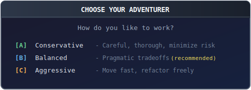

#  CAT: AI Agents that land on their feet

> *"Every great project is an adventure. CAT makes sure you enjoy the journey."*

<p align="center">
  <a href="#cat-ai-agents-that-land-on-their-feet"></a>
</p>

---

## The Problem with AI Projects

<p align="center">
  
</p>

This is what herding cats feels like. Brilliant, forgetful, easily distracted cats.

**CAT flips this around.**

You tell CAT your style once. It learns what matters to you. Then it handles the routine stuff automatically while presenting you with meaningful choices at genuine decision points. It's an adventure where you're the author — the plot moves when you say so, and nobody rewrites act two while you're getting coffee.

---

## Your Adventure Awaits

<p align="center">
  <a href="#your-adventure-awaits"></a>
</p>

<p align="center">
  <a href="#quick-start"><b>[A] Quick Start</b></a> ·
  <a href="#how-cat-works"><b>[B] How It Works</b></a> ·
  <a href="#commands"><b>[C] Commands</b></a>
</p>

---

## Quick Start

### Step 1: Join the Adventure

```bash
# Add the plugin marketplace
/plugin marketplace add cowwoc/cat

# Install CAT
/plugin install cat@cowwoc-claude-code-cat

# Verify you're ready
/cat:help
```

### Step 2: Initialize Your Quest

```bash
/cat:init
```

CAT will ask about your project and your preferences:

<p align="center">
  <a href="#quick-start"></a>
</p>

Your answers shape how CAT makes decisions throughout your project.

### Step 3: Chart Your Course

```bash
# Define your first major version (the big picture)
/cat:add-major-version

# Add tasks (optionally specify target version)
/cat:add-task [version]

# See your adventure map
/cat:status
```

### Step 4: Begin the Quest

```bash
/cat:execute-task
```

CAT spawns a subagent in an isolated worktree, executes the task, and presents
you with results at a checkpoint:

<p align="center">
  <a href="#quick-start"></a>
</p>

---

## How CAT Works

### The Map: Hierarchical Planning

Every adventure needs a map. CAT organizes work into three levels:

<p align="center">
  <a href="#the-map-hierarchical-planning">
    
  </a>
</p>

- **Major versions** are your milestones (v1: "Core Features", v2: "Polish & Performance")
- **Minor versions** group related work (v1.0: "Authentication", v1.1: "User Profiles")
- **Tasks** are individual quests sized to fit in a single session

### The Compass: Your Preferences

During `/cat:init`, you choose your adventurer style:

| Preference | What it Controls |
|------------|------------------|
| **Approach** | How CAT recommends paths at decision points |
| **Stakeholder Review** | When to summon the review council |
| **Refactoring** | Whether to clean up code you pass by |

These aren't just settings—they're how CAT learns to think like you.

### The Journey: Task Lifecycle

<p align="center">
  <a href="#the-journey-task-lifecycle">
    
  </a>
</p>

Each task follows this path:

1. **Planning** → PLAN.md defines the quest objectives
2. **Approach Selection** → At forks in the road, you choose the path
3. **Execution** → Subagent works in isolation (no risk to your main branch)
4. **Verification** → Build, test, lint—all must pass
5. **Review** → Optional stakeholder council weighs in
6. **Checkpoint** → You approve or request changes
7. **Completion** → Merged to main, progress saved

### The Safety Net: Reliability Features

Adventures are more fun when you're not worried about falling:

- **Token-Aware Tasks** → Tasks sized to fit within context limits
- **Isolated Worktrees** → Each task runs in its own git worktree
- **Automatic State Tracking** → Never lose progress between sessions
- **Learn from Mistakes** → CAT analyzes failures and prevents repeats
- **Quality Gates** → Multi-perspective reviews catch issues early

---

## Commands

### Your Main Actions

| Command | What It Does |
|---------|--------------|
| `/cat:init` | Start a new adventure (creates project structure) |
| `/cat:status` | View your adventure map with progress |
| `/cat:execute-task` | Begin or continue a quest |
| `/cat:help` | Quick reference for all commands |

### Building Your Map

| Command | What It Does |
|---------|--------------|
| `/cat:add-major-version` | Add a new chapter to your story |
| `/cat:add-minor-version` | Add a section within a chapter |
| `/cat:add-task` | Add a quest to tackle |
| `/cat:research` | Scout ahead before committing to a path |

### Housekeeping

| Command | What It Does |
|---------|--------------|
| `/cat:cleanup` | Clear abandoned worktrees and orphaned branches |
| `/cat:config` | Change your adventurer style |
| `/cat:remove-task` | Remove a quest from the map |

---

## Configuration

Your adventure settings live in `.claude/cat/cat-config.json`:

```json
{
  "version": "1.0.8",
  "yoloMode": false,
  "contextLimit": 200000,
  "targetContextUsage": 40,
  "autoCleanupWorktrees": true,
  "approach": "balanced",
  "stakeholderReview": "high-risk-only",
  "refactoring": "opportunistic"
}
```

### Options Reference

| Option | Type | Default | Description |
|--------|------|---------|-------------|
| `version` | string | — | CAT version (managed automatically for migrations) |
| `yoloMode` | boolean | `false` | Skip all approval gates when `true` |
| `contextLimit` | number | `200000` | Total context window size in tokens |
| `targetContextUsage` | number | `40` | Soft limit percentage for task size |
| `autoCleanupWorktrees` | boolean | `true` | Auto-cleanup worktrees after task completion |
| `approach` | string | `balanced` | Risk tolerance for approach selection |
| `stakeholderReview` | string | `high-risk-only` | When to run multi-perspective reviews |
| `refactoring` | string | `opportunistic` | Cleanup behavior for adjacent code |

**version** — The installed CAT version. Managed automatically by the migration system to track
upgrades and run version-specific migrations.

**yoloMode**
- `false` (Interactive) — Checkpoints after each task, you review and approve changes
- `true` (YOLO) — Automatic progression, skips approval checkpoints

**contextLimit** — The maximum tokens available in your model's context window. Used to calculate
when tasks need decomposition.

**targetContextUsage** — Percentage of `contextLimit` that triggers context warnings. At 40% of
200K (80K tokens), CAT warns that the task may need decomposition.

**autoCleanupWorktrees** — When `true`, automatically removes task worktrees after successful
completion and merge. Set to `false` to keep worktrees for manual inspection.

**approach** — Controls how CAT chooses when multiple implementation paths exist:
- `conservative` — Auto-selects targeted fixes; avoids refactoring; fewer files touched
- `balanced` — You decide at each fork; CAT presents options without recommendation
- `aggressive` — Auto-selects root-cause solutions; refactors when it improves code quality

**stakeholderReview** — Controls when the 5-perspective review gate runs:
- `always` — Run stakeholder review on every task
- `high-risk-only` — Only review tasks marked HIGH risk in PLAN.md
- `never` — Skip stakeholder reviews entirely

**refactoring** — Controls opportunistic cleanup of code adjacent to changes:
- `avoid` — Never touch code outside the immediate task scope
- `opportunistic` — Clean up obviously related code when low-risk
- `eager` — Actively improve surrounding code quality

---

## Skills Reference

Skills are specialized abilities CAT can invoke. Most run automatically, but some
you can call directly:

### Git Operations
`git-commit` · `git-squash` · `git-rebase` · `git-amend` · `git-merge-linear`

### Multi-Agent Coordination
`spawn-subagent` · `monitor-subagents` · `collect-results` · `merge-subagent` · `parallel-execute`

### Quality & Learning
`stakeholder-review` · `learn-from-mistakes` · `run-retrospective` · `decompose-task`

---

## Project Structure

After `/cat:init`, your project gains an adventure journal:

```
your-project/
└── .claude/cat/
    ├── PROJECT.md          # Your quest overview
    ├── ROADMAP.md          # The big picture
    ├── cat-config.json     # Your preferences
    └── v1/                 # Major version 1
        ├── STATE.md        # Chapter progress
        ├── PLAN.md         # Chapter objectives
        └── v1.0/           # Minor version
            ├── STATE.md    # Section progress
            └── setup-auth/ # Individual task
                ├── STATE.md
                └── PLAN.md
```

---

## Tips for a Successful Adventure

**Start small** — Begin with one major version and a few tasks. Expand as you
find your rhythm.

**Check your map** — Run `/cat:status` often. It shows where you are and
suggests next steps.

**Scout unfamiliar territory** — Use `/cat:research` before tackling complex
features in unknown domains.

**Clear the fog** — Run `/clear` between tasks to start fresh with full context.

**Trust the process** — CAT tracks state automatically. If a session ends
mid-task, just run `/cat:execute-task` to continue where you left off.

---

## Contributing

CAT is opinionated by design. It does a few things well rather than everything
poorly.

Contributions are welcome when they:
- Solve real problems encountered during structured project execution
- Align with the existing adventure-style workflow
- Maintain the focused nature of the tool

Open an issue to discuss before investing significant effort.

---

## License

CAT Source-Available Commercial License — see [LICENSE.md](LICENSE.md)

Free for personal use and small organizations (< $100K/year revenue).
Commercial use requires a paid license.

---

<p align="center"><em>Now go build something amazing.</em> 🐱</p>
