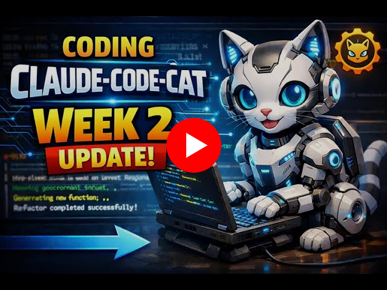
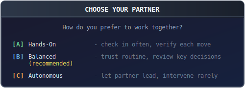

#  CAT: AI Coding That Ships on Schedule

> *"Build on solid ground, not a house of cards."*

<p align="center">
  <a href="#cat-ai-agents-that-land-on-their-feet"></a>
</p>

**CAT transforms chaotic AI coding sessions into predictable, reliable delivery.** Your team gets consistent results,
trackable progress, and code that passes review the first time.

| Benefit | Impact |
|---------|--------|
| **Predictable Progress** | Track completion across versions, tasks, and milestones |
| **Consistent Quality** | Every developer follows the same structured workflow |
| **Reduced Rework** | Built-in verification catches issues before code review |
| **Team Alignment** | Shared preferences and quality gates across projects |

---

## The Problem: AI Coding Without Structure

<p align="center">
  
</p>

**For Engineering Leaders:** AI tools promise 10x productivity, but deliver unpredictable results. One developer gets magic, another gets chaos. Progress is invisible until something breaks.

**For Teams:** AI assistants forget context, ignore conventions, and make inconsistent decisions. Every session starts from scratch. Code quality varies wildly.

**CAT solves this.** You define your standards once. CAT enforces them consistently across every developer, every task, every session. Work progresses when you approve it. Nothing changes while you're away.

---

## See It In Action

<p align="center">
  <a href="https://www.youtube.com/watch?v=IvRLJq989og&t=167s">
    
  </a>
  <br/>
  <em>See how CAT transforms chaotic AI coding into structured, reliable progress.</em>
</p>

---

## Getting Started

<p align="center">
  <a href="#getting-started"></a>
</p>

<p align="center">
  <a href="#quick-start"><b>[A] Quick Start</b></a> ·
  <a href="#how-cat-works"><b>[B] How It Works</b></a> ·
  <a href="#commands"><b>[C] Commands</b></a>
</p>

---

## Quick Start

### Step 1: Install CAT

```bash
# Add the plugin marketplace
/plugin marketplace add cowwoc/cat

# Install CAT
/plugin install cat@cowwoc-claude-code-cat

# Verify you're ready
/cat:help
```

### Step 2: Initialize Your Project

```bash
/cat:init
```

CAT will ask about your project and your preferences:

<p align="center">
  <a href="#quick-start"></a>
</p>

Your answers shape how CAT makes decisions throughout your project.

### Step 3: Chart Your Course

```bash
# Add structure (versions and tasks)
/cat:add

# See your project status
/cat:status
```

### Step 4: Start Working

```bash
/cat:work
```

CAT spawns a subagent in an isolated worktree, executes the task, and presents
you with results at a checkpoint:

<p align="center">
  <a href="#quick-start"></a>
</p>

---

## How CAT Works

### Hierarchical Planning

CAT organizes work into three levels:

<p align="center">
  <a href="#hierarchical-planning">
    
  </a>
</p>

- **Major versions** are your milestones (v1: "Core Features", v2: "Polish & Performance")
- **Minor versions** group related work (v1.0: "Authentication", v1.1: "User Profiles")
- **Tasks** are individual units of work sized to fit in a single session

### Team Preferences

During `/cat:init`, you configure preferences that apply consistently across your team:

| Preference | What It Controls |
|------------|------------------|
| **Trust** | How much autonomy CAT has to make decisions |
| **Verify** | What verification runs before presenting changes |
| **Curiosity** | Whether CAT notes optimization opportunities beyond the task |
| **Patience** | When CAT acts on discovered opportunities |

**For Teams:** These preferences become your team's coding standards. Every developer, every project, every session
follows the same rules.

### The Workflow: Task Lifecycle

<p align="center">
  <a href="#the-workflow-task-lifecycle">
    
  </a>
</p>

Each task follows this path:

1. **Planning** → PLAN.md defines the task objectives
2. **Approach Selection** → At forks in the road, you choose the path
3. **Execution** → Subagent works in isolation (no risk to your main branch)
4. **Verification** → Build, test, lint—all must pass
5. **Review** → Optional stakeholder council weighs in
6. **Checkpoint** → You approve or request changes
7. **Completion** → Merged to main, progress saved

### Built-In Reliability

CAT includes safeguards that protect your codebase and ensure consistent delivery:

| Feature | Business Value |
|---------|----------------|
| **Token-Aware Tasks** | Tasks sized to complete successfully, reducing failed sessions |
| **Isolated Worktrees** | Each task runs separately — no risk to your main branch |
| **Automatic State Tracking** | Resume instantly after interruptions — no lost progress |
| **Learn from Mistakes** | CAT analyzes failures and prevents the same issues recurring |
| **Quality Gates** | Multi-perspective reviews catch bugs before they reach production |

---

## Terminology

### Issue
An **issue** is an atomic unit of work tracked by CAT. Each issue has a unique ID (e.g., `v2.1-setup-auth`),
associated files (STATE.md and PLAN.md), and tracks progress from planning through completion.

### Sub-issue
A **sub-issue** is a child issue created when a parent issue exceeds context limits and must be decomposed.
Sub-issues follow the same structure as regular issues but exist to break down work into manageable chunks.
The parent issue's STATE.md lists all sub-issues and their relationships.

### Wave
A **wave** is a dependency-ordered group of sub-issues that can execute in parallel. Waves are numbered sequentially
(Wave 1, Wave 2, Wave 3, etc.). All sub-issues in Wave N must complete before any sub-issue in Wave N+1 can begin.
Wave 1 contains sub-issues with no dependencies. Wave 2 contains sub-issues that depend only on Wave 1, and so on.

Waves are an internal execution concept used during issue decomposition and orchestration. They are not exposed to
end users but appear in STATE.md files for decomposed issues.

**Example:** The `migrate-python-to-java` issue decomposes into 5 waves:
- Wave 1: Foundation (1 sub-issue)
- Wave 2: Core infrastructure (1 sub-issue)
- Wave 3: Handlers and utilities (6 sub-issues executing concurrently)
- Wave 4: Tests (1 sub-issue)
- Wave 5: Cleanup (1 sub-issue)

---

## Commands

### Your Main Actions

| Command | What It Does |
|---------|--------------|
| `/cat:init` | Initialize project structure |
| `/cat:status` | View project status and progress |
| `/cat:work [scope]` | Execute tasks (see below) |
| `/cat:help` | Quick reference for all commands |

**`/cat:work` scope options:**

| Scope | Example | What Happens |
|-------|---------|--------------|
| (none) | `/cat:work` | Work through ALL incomplete tasks |
| major | `/cat:work 0` | Complete all tasks in v0.x |
| minor | `/cat:work 0.5` | Complete all tasks in v0.5 |
| task | `/cat:work 0.5-auth` | Complete single task only |

When trust >= medium, CAT auto-continues to the next task within scope.

### Building Your Map

| Command | What It Does |
|---------|--------------|
| `/cat:add [description]` | Add a task or version. With description, creates task directly |
| `/cat:research` | Research before committing to an approach |

### Housekeeping

| Command | What It Does |
|---------|--------------|
| `/cat:cleanup` | Clear abandoned worktrees and orphaned branches |
| `/cat:config` | Change your preferences |
| `/cat:learn` | Analyze and learn from mistakes |
| `/cat:remove` | Remove a task or version |

### Plugin Development

| Command | What It Does |
|---------|--------------|
| `/cat:skill-builder` | Design or update skills/commands using backward reasoning |

---

## Configuration

Your CAT settings live in `.claude/cat/cat-config.json`:

```json
{
  "trust": "medium",
  "verify": "changed",
  "curiosity": "low",
  "patience": "high",
  "terminalWidth": 120
}
```

### Options Reference

| Option | Type | Default | Description |
|--------|------|---------|-------------|
| `trust` | string | `medium` | Autonomy level (controls review and approval behavior) |
| `verify` | string | `changed` | What verification runs before checkpoints |
| `curiosity` | string | `low` | Whether CAT notices opportunities beyond the task |
| `patience` | string | `high` | When CAT acts on discovered opportunities |
| `terminalWidth` | number | `120` | Display width in characters for output formatting |
| `autoRemoveWorktrees` | boolean | `true` | Auto-cleanup worktrees on task completion |

**trust** — How much trust you place in CAT to make decisions:
- `low` — CAT presents options frequently; you guide most decisions
- `medium` — CAT presents options for meaningful trade-offs; handles routine choices
- `high` — CAT decides autonomously; only presents HIGH risk or architectural choices

**verify** — What verification CAT runs before presenting changes:
- `none` — No verification; fastest iteration
- `changed` — Verify modified file/module only; balanced confidence
- `all` — Verify entire project; highest confidence before checkpoint

**curiosity** — Whether CAT notices optimization opportunities while working:
- `low` — Stays focused; only completes the assigned task
- `medium` — Notes obvious issues in touched files; documents but doesn't act
- `high` — Actively explores for improvements; documents opportunities found

**patience** — When CAT acts on opportunities discovered during work:
- `low` — Acts immediately on high-priority discoveries (benefit/cost > 3)
- `medium` — Defers most discoveries; acts on critical issues only
- `high` — Defers all discoveries to backlog; maximum focus on current task

**terminalWidth** — Display width in characters for output formatting:
- `120` — Desktop/Laptop (Recommended). Optimized for wide monitors
- `50` — Mobile. Optimized for phones and narrow screens
- `40-200` — Custom. Any value in this range is valid

### Stakeholder Reviews

When `verify` is `changed` or `all`, CAT runs multi-perspective stakeholder reviews before merge:

| Stakeholder | Focus |
|-------------|-------|
| **requirements** | Verifies task satisfies its claimed requirements from PLAN.md |
| **architect** | System design, module boundaries, API design, dependencies |
| **security** | Vulnerabilities, injection, auth, input validation |
| **quality** | Code duplication, complexity, maintainability, obvious bugs |
| **tester** | Test coverage, missing tests, edge cases |
| **performance** | Algorithm complexity, memory usage, blocking operations |
| **ux** | Usability, accessibility, interaction design |
| **sales** | Customer value, competitive positioning, demo-readiness |
| **marketing** | Positioning, messaging, go-to-market readiness |

---

## Skills Reference

Skills are specialized abilities CAT can invoke. Most run automatically, but some
you can call directly:

### Git Operations
`git-commit` · `git-squash` · `git-rebase` · `git-amend` · `git-merge-linear`

### Multi-Agent Coordination
`spawn-subagent` · `monitor-subagents` · `collect-results` · `merge-subagent` · `parallel-execute`

### Quality & Learning
`stakeholder-review` · `learn-from-mistakes` · `run-retrospective` · `decompose-task`

---

## Project Structure

After `/cat:init`, your project gains a planning structure:

```
your-project/
└── .claude/cat/
    ├── PROJECT.md          # Project overview
    ├── ROADMAP.md          # The big picture
    ├── cat-config.json     # Your preferences
    └── v1/                 # Major version 1
        ├── STATE.md        # Chapter progress
        ├── PLAN.md         # Chapter objectives
        └── v1.0/           # Minor version
            ├── STATE.md    # Section progress
            └── setup-auth/ # Individual task
                ├── STATE.md
                └── PLAN.md
```

---

## Tips for Success

**Start small** — Begin with one major version and a few tasks. Expand as you
find your rhythm.

**Check status** — Run `/cat:status` often. It shows where you are and
suggests next steps.

**Scout unfamiliar territory** — Use `/cat:research` before tackling complex
features in unknown domains.

**Clear the fog** — Run `/clear` between tasks to start fresh with full context.

**Trust the process** — CAT tracks state automatically. If a session ends
mid-task, just run `/cat:work` to continue where you left off.

---

## Development

| Branch | Purpose |
|--------|---------|
| `main` | Stable release — install from here |
| `v2.1` | Next version in development |

The development branch reference is updated automatically when a new version is released.

---

## Contributing

CAT is opinionated by design. It does a few things well rather than everything
poorly.

Contributions are welcome when they:
- Solve real problems encountered during structured project execution
- Align with the existing structured workflow
- Maintain the focused nature of the tool

Open an issue to discuss before investing significant effort.

---

## License

CAT Source-Available Commercial License — see [LICENSE.md](LICENSE.md)

**Free for solo developers.** See [pricing](docs/PRICING.md) for team and enterprise options.

---

<p align="center"><em>Now go build something amazing.</em></p>
