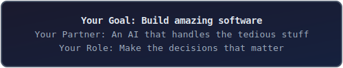
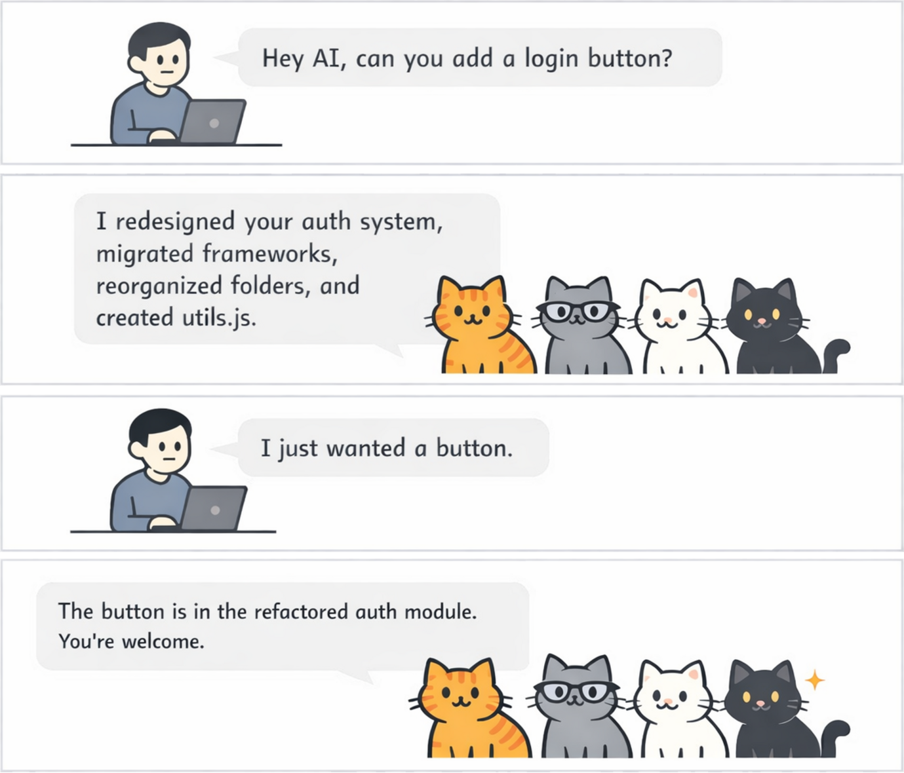
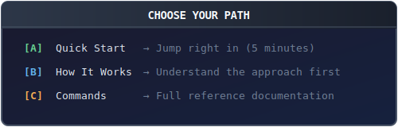
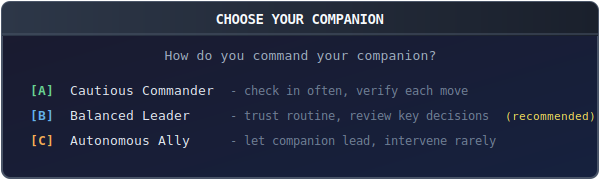
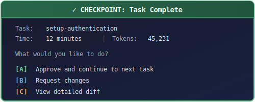
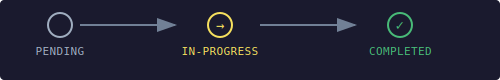

#  CAT: AI Agents that land on their feet

> *"Every great project needs structure. CAT keeps you in control while handling the complexity."*

<p align="center">
  <a href="#cat-ai-agents-that-land-on-their-feet"></a>
</p>

---

## The Problem with AI Projects

<p align="center">
  
</p>

This is what herding cats feels like. Brilliant, forgetful, easily distracted cats.
**CAT flips this around.**

You tell CAT your style once. It learns what matters to you. Then it handles the routine stuff automatically while presenting you with meaningful choices at genuine decision points. You're in control — work progresses when you say so, and nothing changes while you're away.

---

## Getting Started

<p align="center">
  <a href="#getting-started"></a>
</p>

<p align="center">
  <a href="#quick-start"><b>[A] Quick Start</b></a> ·
  <a href="#how-cat-works"><b>[B] How It Works</b></a> ·
  <a href="#commands"><b>[C] Commands</b></a>
</p>

---

## Quick Start

### Step 1: Install CAT

```bash
# Add the plugin marketplace
/plugin marketplace add cowwoc/cat

# Install CAT
/plugin install cat@cowwoc-claude-code-cat

# Verify you're ready
/cat:help
```

### Step 2: Initialize Your Project

```bash
/cat:init
```

CAT will ask about your project and your preferences:

<p align="center">
  <a href="#quick-start"></a>
</p>

Your answers shape how CAT makes decisions throughout your project.

### Step 3: Chart Your Course

```bash
# Define your first major version (the big picture)
/cat:add-major-version

# Add tasks (optionally specify target version)
/cat:add-task [version]

# See your project status
/cat:status
```

### Step 4: Start Working

```bash
/cat:work
```

CAT spawns a subagent in an isolated worktree, executes the task, and presents
you with results at a checkpoint:

<p align="center">
  <a href="#quick-start"></a>
</p>

---

## How CAT Works

### The Map: Hierarchical Planning

CAT organizes work into three levels:

<p align="center">
  <a href="#the-map-hierarchical-planning">
    
  </a>
</p>

- **Major versions** are your milestones (v1: "Core Features", v2: "Polish & Performance")
- **Minor versions** group related work (v1.0: "Authentication", v1.1: "User Profiles")
- **Tasks** are individual units of work sized to fit in a single session

### The Compass: Your Preferences

During `/cat:init`, you configure your preferences:

| Preference | What it Controls |
|------------|------------------|
| **Trust** | How much you trust CAT to make decisions autonomously |
| **Verify** | What verification CAT runs before checkpoints |
| **Curiosity** | Whether CAT notices optimization opportunities beyond the task |
| **Patience** | When CAT acts on discovered opportunities |

These aren't just settings—they're how CAT learns to think like you.

### The Workflow: Task Lifecycle

<p align="center">
  <a href="#the-workflow-task-lifecycle">
    
  </a>
</p>

Each task follows this path:

1. **Planning** → PLAN.md defines the task objectives
2. **Approach Selection** → At forks in the road, you choose the path
3. **Execution** → Subagent works in isolation (no risk to your main branch)
4. **Verification** → Build, test, lint—all must pass
5. **Review** → Optional stakeholder council weighs in
6. **Checkpoint** → You approve or request changes
7. **Completion** → Merged to main, progress saved

### The Safety Net: Reliability Features

Reliability features keep your project safe:

- **Token-Aware Tasks** → Tasks sized to fit within context limits
- **Isolated Worktrees** → Each task runs in its own git worktree
- **Automatic State Tracking** → Never lose progress between sessions
- **Learn from Mistakes** → CAT analyzes failures and prevents repeats
- **Quality Gates** → Multi-perspective reviews catch issues early

---

## Commands

### Your Main Actions

| Command | What It Does |
|---------|--------------|
| `/cat:init` | Initialize project structure |
| `/cat:status` | View project status and progress |
| `/cat:work [scope]` | Execute tasks (see below) |
| `/cat:help` | Quick reference for all commands |

**`/cat:work` scope options:**

| Scope | Example | What Happens |
|-------|---------|--------------|
| (none) | `/cat:work` | Work through ALL incomplete tasks |
| major | `/cat:work 0` | Complete all tasks in v0.x |
| minor | `/cat:work 0.5` | Complete all tasks in v0.5 |
| task | `/cat:work 0.5-auth` | Complete single task only |

When trust >= medium, CAT auto-continues to the next task within scope.

### Building Your Map

| Command | What It Does |
|---------|--------------|
| `/cat:add-major-version` | Add a new milestone |
| `/cat:add-minor-version` | Add a section within a milestone |
| `/cat:add-task` | Add a task to complete |
| `/cat:research` | Research before committing to an approach |

### Housekeeping

| Command | What It Does |
|---------|--------------|
| `/cat:cleanup` | Clear abandoned worktrees and orphaned branches |
| `/cat:config` | Change your preferences |
| `/cat:remove-task` | Remove a task |

---

## Configuration

Your CAT settings live in `.claude/cat/cat-config.json`:

```json
{
  "contextLimit": 200000,
  "targetContextUsage": 40,
  "trust": "medium",
  "verify": "changed",
  "curiosity": "low",
  "patience": "high"
}
```

### Options Reference

| Option | Type | Default | Description |
|--------|------|---------|-------------|
| `contextLimit` | number | `200000` | Total context window size in tokens |
| `targetContextUsage` | number | `40` | Soft limit percentage for task size |
| `trust` | string | `medium` | Autonomy level (controls review and approval behavior) |
| `verify` | string | `changed` | What verification runs before checkpoints |
| `curiosity` | string | `low` | Whether CAT notices opportunities beyond the task |
| `patience` | string | `high` | When CAT acts on discovered opportunities |

**trust**
- `low` — Asks before fixing review issues. Presents options frequently.
- `medium` — Auto-fixes review issues. Presents meaningful choices.
- `high` — Full autonomy. Skips review. Auto-merges.

**contextLimit** — The maximum tokens available in your model's context window. Used to calculate
when tasks need decomposition.

**targetContextUsage** — Percentage of `contextLimit` that triggers context warnings. At 40% of
200K (80K tokens), CAT warns that the task may need decomposition.

**trust** — How much trust you place in CAT to make decisions:
- `low` — CAT presents options frequently; you guide most decisions
- `medium` — CAT presents options for meaningful trade-offs; handles routine choices
- `high` — CAT decides autonomously; only presents HIGH risk or architectural choices

**verify** — What verification CAT runs before presenting changes:
- `none` — No verification; fastest iteration
- `changed` — Verify modified file/module only; balanced confidence
- `all` — Verify entire project; highest confidence before checkpoint

**curiosity** — Whether CAT notices optimization opportunities while working:
- `low` — Stays focused; only completes the assigned task
- `medium` — Notes obvious issues in touched files; documents but doesn't act
- `high` — Actively explores for improvements; documents opportunities found

**patience** — When CAT acts on opportunities discovered during work:
- `low` — Acts immediately on high-priority discoveries (benefit/cost > 3)
- `medium` — Defers most discoveries; acts on critical issues only
- `high` — Defers all discoveries to backlog; maximum focus on current task

### Stakeholder Reviews

When `verify` is `changed` or `all`, CAT runs multi-perspective stakeholder reviews before merge:

| Stakeholder | Focus |
|-------------|-------|
| **requirements** | Verifies task satisfies its claimed requirements from PLAN.md |
| **architect** | System design, module boundaries, API design, dependencies |
| **security** | Vulnerabilities, injection, auth, input validation |
| **quality** | Code duplication, complexity, maintainability, obvious bugs |
| **tester** | Test coverage, missing tests, edge cases |
| **performance** | Algorithm complexity, memory usage, blocking operations |
| **ux** | Usability, accessibility, interaction design |
| **sales** | Customer value, competitive positioning, demo-readiness |
| **marketing** | Positioning, messaging, go-to-market readiness |

---

## Skills Reference

Skills are specialized abilities CAT can invoke. Most run automatically, but some
you can call directly:

### Git Operations
`git-commit` · `git-squash` · `git-rebase` · `git-amend` · `git-merge-linear`

### Multi-Agent Coordination
`spawn-subagent` · `monitor-subagents` · `collect-results` · `merge-subagent` · `parallel-execute`

### Quality & Learning
`stakeholder-review` · `learn-from-mistakes` · `run-retrospective` · `decompose-task`

---

## Project Structure

After `/cat:init`, your project gains a planning structure:

```
your-project/
└── .claude/cat/
    ├── PROJECT.md          # Project overview
    ├── ROADMAP.md          # The big picture
    ├── cat-config.json     # Your preferences
    └── v1/                 # Major version 1
        ├── STATE.md        # Chapter progress
        ├── PLAN.md         # Chapter objectives
        └── v1.0/           # Minor version
            ├── STATE.md    # Section progress
            └── setup-auth/ # Individual task
                ├── STATE.md
                └── PLAN.md
```

---

## Tips for Success

**Start small** — Begin with one major version and a few tasks. Expand as you
find your rhythm.

**Check status** — Run `/cat:status` often. It shows where you are and
suggests next steps.

**Scout unfamiliar territory** — Use `/cat:research` before tackling complex
features in unknown domains.

**Clear the fog** — Run `/clear` between tasks to start fresh with full context.

**Trust the process** — CAT tracks state automatically. If a session ends
mid-task, just run `/cat:work` to continue where you left off.

---

## Contributing

CAT is opinionated by design. It does a few things well rather than everything
poorly.

Contributions are welcome when they:
- Solve real problems encountered during structured project execution
- Align with the existing structured workflow
- Maintain the focused nature of the tool

Open an issue to discuss before investing significant effort.

---

## License

CAT Source-Available Commercial License — see [LICENSE.md](LICENSE.md)

Free for personal use and small organizations (< $100K/year revenue).
Commercial use requires a paid license.

---

<p align="center"><em>Now go build something amazing.</em> 🐱</p>
